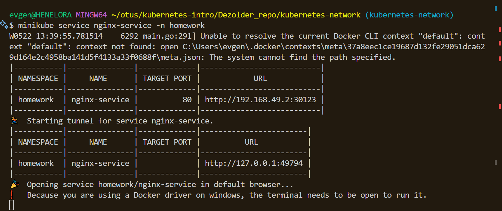
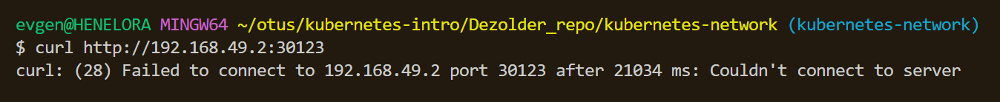

# Репозиторий для выполнения домашних заданий курса "Инфраструктурная платформа на основе Kubernetes-2024-02" 

### Help!!!

Никак не получается запустить сервис NodePort, как было на лекции:


После команды:
```bash
minikube service nginx-service -n homework
```

у меня успешно открывается браузер по адресу http://127.0.0.1:49794

Но на лекции показано, что сервис дложен быть доступен по адресу http://192.168.49.2:30123

А у меня почему-то этот адрес не доступен:


Соответственно Ingress тоже не работает.
После добавления в файл hosts строки:
```bash
192.168.49.2 homework.otus
```
это доменное имя всё равно не резолвится.

(Я работаю в окружении Windows, Docker, miniKube v1.33.1)

Подскажите, пожалуйста, в чем может быть проблема?