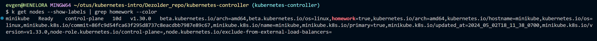

# Репозиторий для выполнения домашних заданий курса "Инфраструктурная платформа на основе Kubernetes-2024-02" 

### ДЗ №3 Services
https://cdn.otus.ru/media/public/7e/f4/%D0%94%D0%97_4___Volumes__StorageClass__PV__PVC_.pptx-73510-7ef4d2.pdf

### 1
Создан манифест PersistentVolumeClaim pvc.yaml, c storageClass по-умолчанию:
```yaml
apiVersion: v1
kind: PersistentVolumeClaim
metadata:
  name: nginx-pvc
  namespace: homework
spec:
  resources:
    requests:
      storage: 1Gi
  volumeMode: Filesystem
  accessModes:
    - ReadWriteOnce
```
### 2 
Меняю Манифест Deployment на использование PVC:
```yaml
      volumes:
        - name: workdir
          # emptyDir: {}
          persistentVolumeClaim:
            claimName: nginx-pvc
```
### 3
Создаю ConfigMap:
```yaml
apiVersion: v1
kind: ConfigMap
metadata:
  name: myapp-config
  namespace: homework
data:
  key: value
  foo: bar
```
### 4
Меняю Манифест Deployment на использование ConfigMap:
```yaml
      volumes:
        - name: workdir
          # emptyDir: {}
          persistentVolumeClaim:
            claimName: nginx-pvc
        - name: config-volume
          configMap:
            name: myapp-config
```
### 5
Обновляю точки монтирования (PVC и CM) в основном контейнере:
```yaml
          volumeMounts:
            - name: workdir
              mountPath: /homework
            - name: config-volume
              mountPath: /homework/conf
              readOnly: true
```
### 6
Добавляю новый Ingress для пути /conf/key:
```yaml
apiVersion: networking.k8s.io/v1
kind: Ingress
metadata:
  name: conf-ingress
  # annotations:
  #   nginx.ingress.kubernetes.io/rewrite-target: /$2
spec:
  rules:
  - host: "homework.otus"
    http:
      paths:
      - pathType: Prefix
        path: "/conf"
        # path: "/conf(/key|$)"
        backend:
          service:
            name: nginx-service
            port:
              number: 80
``` 


### 7 (Задание со *)
Создаю файл storageClass.yaml:
```yaml
apiVersion: storage.k8s.io/v1
kind: StorageClass
metadata:
  name: nginx-storage-class
  namespace: homework
provisioner: 'k8s.io/minikube-hostpath'
reclaimPolicy: Retain
```
### 8
Обновляю PVC на использование своего storageClass:
```yaml
apiVersion: v1
kind: PersistentVolumeClaim
metadata:
  name: nginx-pvc
  namespace: homework
spec:
  resources:
    requests:
      storage: 1Gi
  volumeMode: Filesystem
  accessModes:
    - ReadWriteOnce
  storageClassName: nginx-storage-class
```


### 
Запускаю свой скрипт:
```bash
bash bash.sh
```
Вывод скрипта примерно такой:



Этот Вывод содержит ответ от сервера по пути: ```/homepage``` и ```/conf/key```.

А также содержит вывод команды ```kubectl get pvc -n homework```, в котором видно, что после удаления Deployment - PV всё равно остаётся (что обусловлено RECLAIM POLICY: Retain).

#### Рефлексия:
1) Настройка Ingress на rewrite-target со множеством путей всё ещё вызвает турдности.
2) Важно различать какие объекты Kubernetes являются уровня Namespace, а какие уровня Cluster.