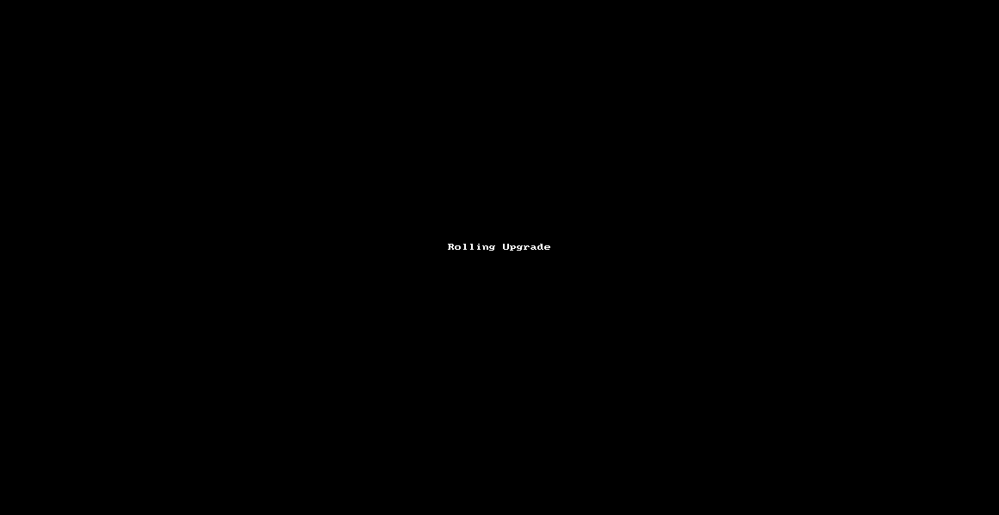

# Репозиторий для выполнения домашних заданий курса "Инфраструктурная платформа на основе Kubernetes-2024-02" 

Kubernetes controllers.
ReplicaSet, Deployment,
DaemonSet
---
ДЗ: [Скачать](https://cdn.otus.ru/media/public/6d/a1/%D0%94%D0%97_2___Kubernetes_controllers._ReplicaSet__Deployment__DaemonSet.pptx-73510-6da1af.pdf "Скачать")

---

### Deployment манифест

Похожий как на Pod, но с другими полями:
```yaml
apiVersion: apps/v1
kind: Deployment
metadata:
  name: nginx
  labels:
    app: nginx
  namespace: homework
```

Добавление Replicas, nodeSelector, ReadinessProbe, Стратегии обновления - требует чёткого понимания на каком уровне иерархии они находятся.
С первого раза не получилось, пришлось смотреть в документацию.


### Rolling Update
На этом видео видно выполнение Rolling Update:


> Для запуска Rolling Update, нужно изменить версию образа в манифесте и применить его.

### Задание со ⭐

Добавить label на ноду minikube:
```bash
kubectl label nodes minikube homework=true
```

Проверить, что label добавлен:
```bash
kubectl get nodes --show-labels
``` 

Рузультат:


Добавить в манифест Deployment ```spec.template.spec``` селектор узла по label:
```yaml
NodeSelector:
  homework: "true"
```
Результат:
Всё получилось!

>Дополнительно попробовал поменять label ```homework=false``` на ноде и убедился что, deployment создаётся в статусе 0/3.
Но если ещё и поменять label в манифесте, то поды моментально поднимаются.
То-есть, Kubernetes учитывает label в манифесте, а не на ноде сам.


### Рефлексия
1) По прежнему не понимаю как правильно заполнять поле apiVersion.
2) Понял, что важно понимать иерархию полей в манифесте.
3) Понял, что важно понимать как работает Rolling Update.
4) Понял, что важно понимать как работает NodeSelector.
5) Понял, что важно понимать как работает ReadinessProbe.
