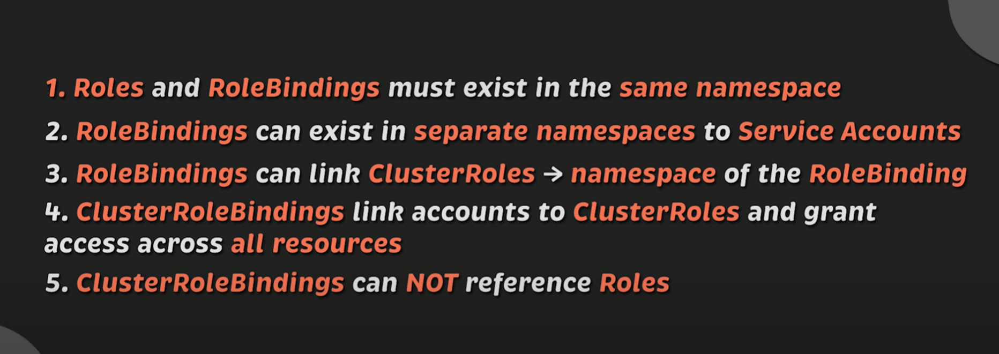

# Репозиторий для выполнения домашних заданий курса "Инфраструктурная платформа на основе Kubernetes-2024-02" 

## ДЗ №5 Secutiry

### 1. В namespace homework создать sercie account ```monitoring```  и дать ему доступ к эндпоинту ```/metrics``` вашего кластера:

Манифест в файле ```security.yaml```:
``` yaml
apiVersion: v1
kind: ServiceAccount
metadata:
  name: monitoring
  namespace: homework

---
apiVersion: rbac.authorization.k8s.io/v1
kind: ClusterRole
metadata:
  name: metrics-reader
rules:
- nonResourceURLs:
  - /metrics
  verbs:
  - get
- apiGroups:
  - ""
  - metrics.k8s.io
  resources:
  - nodes
  - nodes/metrics
  - nodes/stats
  - pods
  - pods/metrics
  - pods/log
  - endpoints
  verbs:
  - get
  - list
  - watch

---
apiVersion: rbac.authorization.k8s.io/v1
kind: ClusterRoleBinding
metadata:
  name: monitoring-metrics-reader
subjects:
- kind: ServiceAccount
  name: monitoring
  namespace: homework
roleRef:
  kind: ClusterRole
  name: metrics-reader
  apiGroup: rbac.authorization.k8s.io

```
Долго искал как поставить Monitoring Server.  
Оказалось, что он уже доступен в ```minikube``` как аддон!

Несколько дней разбирался как работать с RBAC.  
Некоторые говорят, что понимание приходит через год работы с Kubernetes.  
Мне очень помогло это видео:  
https://youtu.be/iE9Qb8dHqWI?si=NrYuBg-za-F6MwYe  
И эта шпаргалка:


Получилось достать метрики Node. Но метрика Pod почему-то не отдаются (хотя из контейнера она доступна. Почему?)

---
### 2. Изменить манифест deployment из прошлых ДЗ так, чтобы поды запускались под service account monitoring.

Манифест в файле ```deployment.yaml```:
``` yaml
template.spec.serviceAccountName: monitoring
```


---
### 3. В namespace homework создать service account с именем cd  и дать уму роль admin в рамках namespace homework.

Оказывается токен можно создать прямо в манифесте service account.

( аннотации тут ненужны, так как мы не планируем использовать этот секрет в подах, а только в cd.kubeconfig файле )

Манифест в файле ```security.yaml```:
``` yaml
apiVersion: v1
kind: ServiceAccount
metadata:
  name: cd
  namespace: homework
  # annotations:
  #   kubernetes.io/enforce-mountable-secrets: "true"
  secrets:
    - name: my-secret-token
---
apiVersion: rbac.authorization.k8s.io/v1
kind: Role
metadata:
  name: admin
  namespace: homework
rules:
  - apiGroups:
      - "*"
    resources:
      - "*"
    verbs:
      - "*"

---
apiVersion: rbac.authorization.k8s.io/v1
kind: RoleBinding
metadata:
  name: cd-admin
  namespace: homework
roleRef:
  apiGroup: rbac.authorization.k8s.io
  kind: ClusterRole
  name: admin
subjects:
- kind: ServiceAccount
  name: cd
  namespace: homework
```

Создание рулов для ```admin``` - вроде и не нужно, так как в Kubernetes есть эта роль изначально.

---
### 4. Создать kubeconfig для service account cd.

Сначала нужно созать токен. А потом создать kubeconfig.

Манифест в файле ```security.yaml```:
``` yaml
apiVersion: v1
kind: Secret
metadata:
  name: my-secret-token
  namespace: homework
  labels:
    kubernetes.io/legacy-token-invalid-since: "2025-06-20"
  annotations:
    kubernetes.io/service-account.name: "cd"
type: kubernetes.io/service-account-token
```
Note: Этот секрет монтировать в поды не нужно. Он нужен только для создания kubeconfig.

Тут указана дата окончания токена. Но как указать именно один день?

Манифест ```cd.kubeconfig``` создаётся скриптом ```bash.sh```:

``` bash

# Получить имя секрета для Service Account 'cd'
SECRET_NAME=$(kubectl get serviceaccount cd -n homework -o jsonpath='{.secrets[0].name}')

# Получить токен и CA из секрета
TOKEN=$(kubectl get secret $SECRET_NAME -n homework -o jsonpath='{.data.token}')
CA=$(kubectl get secret $SECRET_NAME -n homework -o jsonpath='{.data.ca\.crt}' )

# Получить адрес сервера Kubernetes
SERVER=$(kubectl config view --minify -o jsonpath='{.clusters[0].cluster.server}')

# Сохранить token в файл:
echo $TOKEN > token

# Создать файл kubeconfig
cat > cd.kubeconfig <<EOF
apiVersion: v1
clusters:
- cluster:
    certificate-authority-data: >-
      $CA
    server: $SERVER
  name: minikube
contexts:
- context:
    cluster: minikube
    namespace: homework
    user: cd
  name: cd-context
current-context: cd-context
kind: Config
preferences: {}
users:
- name: cd
  user:
    token: >-
      $TOKEN
EOF
```

Проверить, что получилось:
``` bash
kubectl --kubeconfig=cd.kubeconfig get pods -n homework
```
 
Но у меня не получилось! (((

Пишет:
  ``` 
  error: You must be logged in to the server (Unauthorized)
  ```
 
 
  Почему???
Пожалуйста помогите разобраться!

---
### 5. Сгенерировать для service account cd токен с временем действия 1 день и сохранить его в файл token.

Это сделано в предыдущем пункте.
